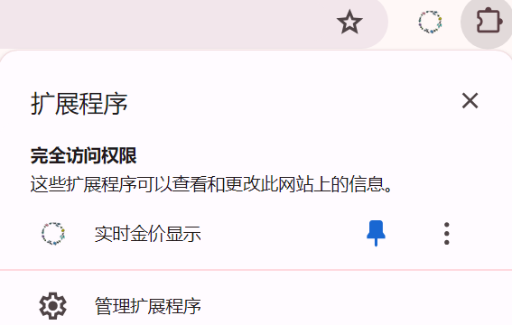
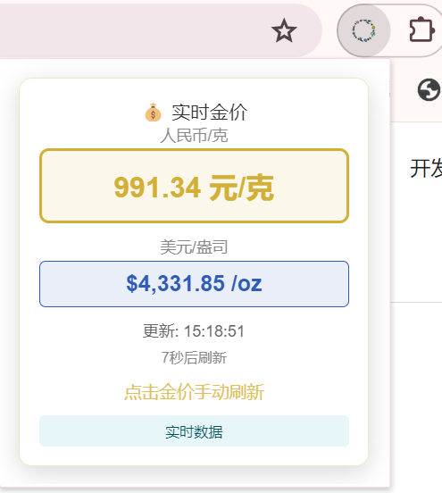

# 实时金价浮窗显示浏览器扩展插件

## 数据来源
实时金价获取网站：<https://www.exchangerates.org.uk/commodities/live-gold-prices.html?iso=USD>

## 扩展使用方法（以Chrome浏览器为例）

### 安装扩展
在本地下载**Gold.zip**并解压后，在Chrome浏览器搜索`chrome://extensions/`，将右上角的`开发者模式`点击至开启后，点击页面内左上的`加载已解压的扩展程序`，后选择解压后的根目录，即可使用。
> 注：建议解压至本地根目录或不含中文字符的路径

### 使用扩展
点击网页右上角拼图样式的扩展图标后即可见名为`实时金价显示`，图标为花环的插件，可选择点亮图钉图标使之固定在书签栏上；

### 扩展浮窗预览

使用时点击花环图标即可见实时金价，单位为`人民币/克` 及`美元/盎司`。
点击矩形框内即可手动刷新
> 使用时建议手动刷新时间间隔不短于5秒
